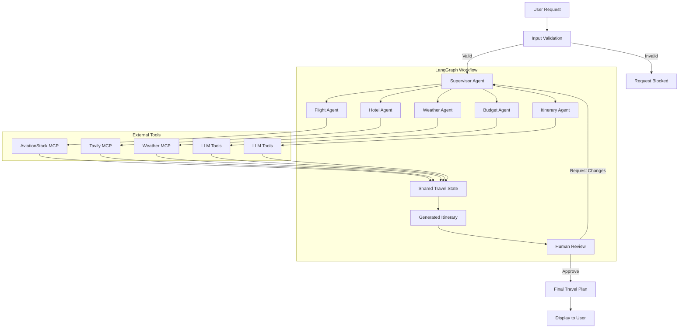

# TravelMind-AI

TravelMind-AI is an AI-powered travel planner that creates personalized trip plans using a multi-agent workflow.

It can take a travel request with details such as destination, dates, budget, and preferences, then gather relevant information about flights, hotels, weather, and activities before generating an itinerary.

The project also supports human feedback, so the user can review the generated plan and ask the system to make changes.

## Live Demo

https://travelmind-ai-x407.onrender.com

## Features

- AI-powered travel planning
- Multi-agent workflow using LangGraph
- Flight and hotel information
- Weather information using OpenWeather
- Web research using Tavily
- Custom weather MCP server
- Human-in-the-loop feedback
- PostgreSQL-based workflow persistence
- LangSmith tracing
- Dockerized deployment
- Deployed on Render

## How It Works

```text
User Request
     ↓
Supervisor
     ↓
┌──────────┬──────────┬──────────┐
│  Flight  │  Hotel   │  Weather │
└──────────┴──────────┴──────────┘
              ↓
          Itinerary
              ↓
        Human Feedback
              ↓
       Updated Itinerary
```

The supervisor coordinates the workflow and uses specialized agents and tools to collect the information needed for the final itinerary.

## Architecture

TravelMind-AI uses a supervisor-based multi-agent architecture. The supervisor decides which agents are needed for a request, while the agents use external tools and shared state to build the final itinerary.



### Main Components

- **Input Guardrails** validate the travel request before starting the workflow.
- **Supervisor Agent** understands the request and dynamically decides which agents are required.
- **Specialized Agents** handle flights, hotels, weather, budget, and itinerary generation.
- **MCP Servers** connect the agents to external services such as AviationStack, Tavily, and OpenWeather.
- **Shared Travel State** keeps the request, constraints, tool results, and itinerary data available across the workflow.
- **Human-in-the-Loop** lets the user approve the itinerary or request changes before the final response.

## Tech Stack

- Python
- LangGraph
- LangChain
- Groq
- MCP
- FastAPI
- PostgreSQL
- OpenWeather API
- Tavily
- AviationStack
- Jinja2
- HTML / CSS / JavaScript
- Docker
- Render
- LangSmith

## Project Structure

```text
TravelMind-AI/
│
├── static/
├── templates/
├── app.py
├── backend.py
├── custom_weather_mcp_server.py
├── mcp_client.py
├── requirements.txt
├── Dockerfile
├── .dockerignore
├── .gitignore
└── README.md
```

## Environment Variables

Create a `.env` file locally and add your API keys:

```env
GROQ_API_KEY=your_groq_api_key
TAVILY_API_KEY=your_tavily_api_key
AVIATIONSTACK_API_KEY=your_aviationstack_api_key
OPENWEATHER_API_KEY=your_openweather_api_key

DEFAULT_ORIGIN_IATA=DEL

DATABASE_URL=your_postgresql_connection_string

LANGSMITH_TRACING=true
LANGSMITH_ENDPOINT=https://api.smith.langchain.com
LANGSMITH_API_KEY=your_langsmith_api_key
LANGSMITH_PROJECT=TravelMind-AI
```

Do not commit the `.env` file or expose your API keys publicly.

## Run Locally

### 1. Clone the repository

```bash
git clone https://github.com/muralikrishna-27/TravelMind-AI.git
cd TravelMind-AI
```

### 2. Create a virtual environment

Windows:

```bash
python -m venv venv
venv\Scripts\activate
```

Linux/macOS:

```bash
python3 -m venv venv
source venv/bin/activate
```

### 3. Install dependencies

```bash
pip install -r requirements.txt
```

### 4. Add environment variables

Create a `.env` file and add the required keys.

### 5. Run the application

```bash
python app.py
```

## Docker

Build the image:

```bash
docker build -t travelmind-ai .
```

Run it:

```bash
docker run -p 8000:8000 --env-file .env travelmind-ai
```

## Example

A user can ask:

```text
Plan a 7-day trip to Japan from India
with a budget of ₹2,00,000.
Include flights, hotels, weather,
and a day-by-day itinerary.
```

The system collects the required information and generates a structured travel plan.

The user can then provide feedback such as:

```text
Add more devotional places and reduce unnecessary travel.
```

The workflow resumes with the new requirement and generates an updated itinerary.

## MCP

TravelMind-AI uses MCP to connect the AI workflow with external tools.

The project includes:

- `mcp_client.py` — MCP client
- `custom_weather_mcp_server.py` — custom weather MCP server

This keeps external tool functionality separate from the main agent workflow.

## Deployment

The application is containerized with Docker and deployed on Render.

Live application:

https://travelmind-ai-x407.onrender.com

## Author

Murali Krishna

GitHub: https://github.com/muralikrishna-27/TravelMind-AI
